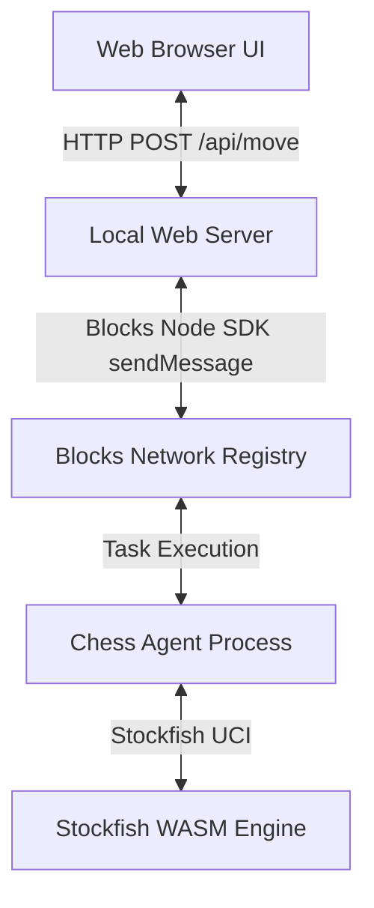

# Chess Agent with Web UI and Stockfish AI

This plan outlines the architecture and implementation steps to build a Chess agent using the Blocks Node SDK and a Web UI that interacts with the agent to play chess against the Stockfish engine.

## Proposed Architecture

1. **Chess Agent (Blocks Provider)**:
   - Built using the Blocks Node SDK (`@blocks-network/sdk`).
   - Receives FEN (position) and difficulty (depth) as input.
   - Spawns Stockfish WASM engine (`@se-oss/stockfish`) to calculate the best move.
   - Returns the best move, evaluation, and updated FEN.
2. **Local Web Server (Proxy)**:
   - A simple Express server that serves the static UI and proxies `/api/move` requests to the Blocks Network using the `TaskClient`.
   - Uses the local `BLOCKS_API_KEY` environment variable.
3. **Web UI (Client)**:
   - A premium, responsive single-page web app built with modern HTML, CSS, and JS.
   - Features a high-fidelity glassmorphism dashboard, dynamic board animations, move history, game stats, and difficulty controls.
   - Integrates `chess.js` in the frontend for client-side move validation and state tracking.

## Proposed Changes

### Component 1: Chess Agent (`chess_agent`)

#### [NEW] [agent-card.json](file:///Users/stephen/Projects/agents-blocks/chess/chess_agent/agent-card.json)
Define the agent name (`chess_agent`), inputs (`fen`, `difficulty`), outputs (`bestMove`, `fen`, `evaluation`), and runtime settings.
- `maxRunningTimeSec`: 60 (Stockfish search is fast, typically under 5-10 seconds).

#### [NEW] [handler.ts](file:///Users/stephen/Projects/agents-blocks/chess/chess_agent/handler.ts)
The TypeScript handler that:
- Reads input FEN and difficulty.
- Spawns Stockfish via `@se-oss/stockfish`.
- Evaluates the position and extracts the best move.
- Applies the move using `chess.js` to compute the updated FEN.
- Returns the results.

#### [NEW] [package.json](file:///Users/stephen/Projects/agents-blocks/chess/chess_agent/package.json)
Configure dependencies including `@blocks-network/sdk`, `chess.js`, `@se-oss/stockfish`, and TypeScript tools.

---

### Component 2: Web UI and Proxy Server (`web_ui`)

#### [NEW] [server.ts](file:///Users/stephen/Projects/agents-blocks/chess/web_ui/server.ts)
A backend Express script that:
- Serves the frontend files.
- Exposes `POST /api/move` to handle moves.
- Authenticates with the Blocks Network using `BLOCKS_API_KEY`.
- Runs `TaskClient.sendMessage` to trigger `chess_agent` and returns the resulting move to the UI.

#### [NEW] [package.json](file:///Users/stephen/Projects/agents-blocks/chess/web_ui/package.json)
Proxy server dependencies (`express`, `dotenv`, `@blocks-network/sdk`, `cors`).

#### [NEW] [index.html](file:///Users/stephen/Projects/agents-blocks/chess/web_ui/public/index.html)
Main HTML file structure with a modern layout, sidebar stats, and a custom interactive chessboard.

#### [NEW] [style.css](file:///Users/stephen/Projects/agents-blocks/chess/web_ui/public/style.css)
Premium, modern stylesheet featuring:
- Glassmorphism design system (`backdrop-filter`, subtle borders).
- Deep indigo/slate/violet color palette.
- Hover animations, board square highlighting, and responsive grids.

#### [NEW] [app.js](file:///Users/stephen/Projects/agents-blocks/chess/web_ui/public/app.js)
Frontend logic:
- Manages the board state and input interaction using a client-side `Chess` instance.
- Tracks player moves and issues API requests to the proxy server when it's the AI's turn.
- Renders the chessboard dynamically with CSS grid and updates the board pieces.
- Handles game end detection (checkmate, draw, stalemate).

---

## Verification Plan

### Automated / CLI Tests
- Run `blocks check` inside `chess_agent` to ensure agent-card compliance.
- Run `npx tsx trigger.ts` inside `chess_agent` to test the handler end-to-end with a sample FEN.

### Manual Verification
- Launch the proxy server, open the UI in a browser, and play a chess game.
- Adjust the difficulty slider and verify that Stockfish takes longer / plays stronger moves.
- Verify game over and restart scenarios.
